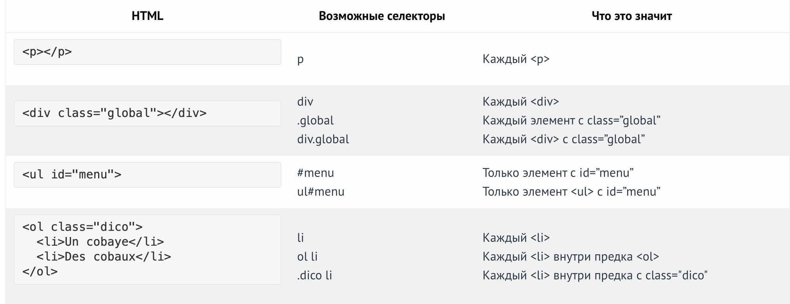

Чтобы ссылки в нашем заголовке были красного цвета:

header a {
  color: red;
}
Это можно читать справа налево как: «выбрать все элементы < а >, которые находятся внутри элемента < heаdеr >». Это заставит все другие ссылки (которые не в заголовке) оставаться неизменными.